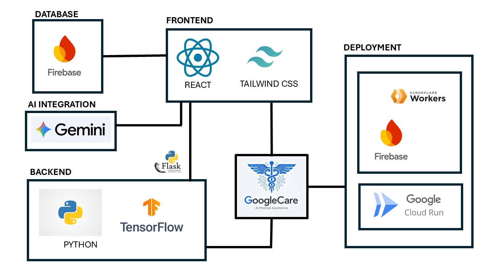

<div align="center">


# 🩺 GoogleCare

### *Your AI-Powered Personal Healthcare Companion*

**Analyze symptoms. Monitor wounds. Check in daily. Respond to emergencies. All in one place.**

[🚀 Live Demo](https://google-care-73225723112.asia-southeast1.run.app)  · [📂 Source Code](https://github.com/davidabouuy1025/GoogleCare_GDG)

</div>

---

## 📋 Table of Contents

- [Overview](#-overview)
- [The Problem We Solve](#-the-problem-we-solve)
- [Key Features](#-key-features)
- [System Architecture](#-system-architecture)
- [AI Integration](#-ai-integration-gemini)
- [Tech Stack](#-tech-stack)
- [Getting Started](#-getting-started)
- [Project Structure](#-project-structure)
- [Database Schema](#-database-schema)
- [Security](#-security)
- [Deployment](#-deployment)
- [Team](#-team)

---

## 🌟 Overview

GoogleCare is a full-stack, AI-powered healthcare web application built for **Project 2030: MyAI Future Hackathon - Vital Signs in terms of Healthcare & Wellbeing (Track 3)**.

It transforms fragmented, manual health monitoring workflows into an **intelligent, automated care system** — powered by **Gemini AI** as the central reasoning engine. From symptom triage to wound classification, daily elderly check-ins to real-time emergency dispatch, GoogleCare replaces guesswork with structured, AI-driven decisions.

> Remove the AI layer, and the system loses its ability to reason, triage, and guide. It's not a feature — it is the backbone!

---

## 🔍 The Problem We Solve

Across Malaysia and beyond, three critical healthcare gaps persist every day:

| Gap | Real-world Impact |
|---|---|
| **Unguided symptom assessment** | Patients either panic over minor issues or dismiss serious ones — both outcomes are dangerous |
| **No wound care literacy** | Improper wound treatment leads to preventable infections and complications |
| **Unsupervised elderly living alone** | Missed check-ins and delayed emergency response cost lives |

GoogleCare addresses all three through a single, unified AI workflow system.

---

## ✨ Key Features

### 🚨 Emergency Response
- **One-tap 999 call** with a confirmation guard to prevent accidental dials
- **Real-time nearest facility finder** using `OpenStreetMap's Overpass API` — locates hospitals, clinics, and pharmacies within 15km of the user's GPS location
- **Pre-loaded emergency scenarios**: Heart Attack, Stroke, Choking, Allergic Reaction, Asthma, Seizure — each with step-by-step first-aid instructions
- **Emergency patient info modal** — surfaces blood type, allergies, and emergency contact the moment 999 is dialled
- Other:
   - *Estimated travel time* per facility calculated using live distance at 35km/h average city speed
   - *Multi-endpoint fallback* — queries 3 Overpass API mirrors to guarantee uptime
   - *Result caching* within 500m / 10-minute window to avoid redundant API calls

---

### 🩺 AI Symptom Analysis
- **Local knowledge base pre-check** — common conditions resolved instantly from `COMMON_CAUSES` dictionary before consuming AI quota
- **Free-text input** — describe symptoms in plain English
(`webkitSpeechRecognition`) for hands-free entry
- **Full AI analysis** returns: top condition, 5 ranked possible conditions with confidence scores, care advice, medication guidance, and risk level (Low / Medium / High)

- Other:
   - *Unsafe input filtering* — `isUnsafeInput()` blocks prompt injection and harmful requests before they reach GLM
   - *Conversational follow-up* — GLM asks a clarifying question when more context is needed; users respond inline for a refined diagnosis
   - *Text-to-speech* output via Web Speech Synthesis API
   - *Firestore persistence* — every analysis saved to `symptoms` collection with timestamp and risk level for dashboard history

---

### 🩸 Wound Analysis
- **6 wound types classified**: Surgical Incision, Minor Burn, Skin Ulcer, Skin Cut, Wound Infection, Contusion
- **Wound Reference Guide** — 6 illustrated cards; tap any to open a modal with full clinical description, numbered care steps, and a colour-coded urgency banner (Low / Moderate / Seek Care Soon)
- **Dual-model parallel inference** — AI vision model (`GoogleVision`) and a custom-trained Python/TensorFlow classifier run simultaneously on the same image
- **Confidence score bars** per class from the Python model's softmax output
- **AI analysis card** — wound type, clinical description, and care recommendations from GLM
- **Python model card** — wound type, confidence %, all-class scores with animated progress bars, plus hardcoded explanation and care steps from `WOUND_EXPLANATION` / `WOUND_TODO` lookup tables
- Other:
   - *Python server health check* — live status indicator; gracefully degrades to AI-only mode if server is offline
   - *45-second cooldown* between AI calls to manage quota responsibly
   - *Firestore persistence* — results saved to `wounds` collection with both model outputs

---

### 👴 Elderly Check-In System
- **Mood logging** — 4 mood states (Happy, Neutral, Sad, Tired) with emoji-based UI
- **Vitals and health notes** — free-text field for blood pressure, heart rate, or any observations
- **AI risk assessment** — GLM evaluates mood and vitals together, returns risk level and care recommendation
- **Configurable daily deadline** — caregivers or patients set a check-in time (e.g., 09:00); the system tracks compliance
- **Missed deadline detection** — `deadlineMissed` flag triggers a persistent alert in the Dashboard and sidebar
- **Emergency contact notification logic** — system tracks and surfaces the contact when deadline is missed
- Other:
   - **Smart AI routing** — happy mood + normal vitals resolves locally without consuming AI quota; concerning inputs trigger full GLM assessment
   - **One record per day** — uses composite document ID (`patientId_dateKey`) in Firestore to prevent duplicate check-ins
   - **7-day mood history** — rendered as an emoji timeline on the Dashboard

---

### 📊 Health Dashboard
- **Personalised greeting** with patient name
- **7-day mood history** — scrollable emoji timeline
- **Full symptom history** — all past analyses with condition, risk badge, and date
- **Risk alerts panel** — surfaces all Medium and High risk symptom records
- **Check-In Overdue alert** — pulsing red banner in sidebar and dashboard when deadline is missed
- **One-tap Emergency button** — always visible at the top of the dashboard

---

### 👤 Patient Profile
- **Inline editable fields** — click any field to edit in place; changes sync to Firestore in real time
- **Medical details**: name, age, contact, address, emergency contact, conditions, allergies, blood type
- **Blood type selector** with all 8 types
- **AI Diagnostic Engine status checker** — tests GLM connectivity on demand
- **Daily Check-In Reminder toggle** — enables / disables the check-in enforcement system
- **Patient ID display** for reference

---

### 💬 Community Forum
- Community discussion tab powered by `TabForum` component
- Enables peer support and information sharing between users

---

## 🏗 System Architecture
### Tech Stack - Model Context Protocol


### Request Flow — Symptom Analysis

```
User Input (text / voice / tags)
        │
        ▼
isUnsafeInput() filter
        │
        ├── UNSAFE → return safe error message
        │
        └── SAFE
              │
              ▼
        Local COMMON_CAUSES lookup
              │
              ├── MATCH → return instantly (no AI quota used)
              │
              └── NO MATCH
                      │
                      ▼
                45s cooldown check
                      │
                      ▼
                GEMINI API call (aiService.ts)
                      │
                      ▼
              Parse structured response
              (condition, confidence, advice, risk, followUpQ)
                      │
                      ├── Save to Firestore (symptoms/)
                      │
                      └── Render result + offer follow-up
```

### Request Flow — Wound Analysis

```
Image Upload (file or URL)
        │
        ▼
Convert to Base64
        │
        ▼
Run in parallel:
  ┌─────────────────┐      ┌─────────────────────────┐
  │  GLM Vision     │      │  Python Flask Server     │
  │  analyzeWound() │      │  POST /api/python/analyze│
  │                 │      │  TensorFlow model        │
  │  → type         │      │  → type + confidence     │
  │  → analysis     │      │  → allScores [6 classes] │
  │  → recommend.   │      │                          │
  └────────┬────────┘      └────────────┬─────────────┘
           │                            │
           └──────────┬─────────────────┘
                      ▼
              Merge results into WoundResult
                      │
                      ├── Save to Firestore (wounds/)
                      │
                      └── Render dual result cards
```

---

## 🤖 AI Integration (Gemini)

GLM is the central reasoning engine. It is not optional — removing it collapses the core functionality of three out of six features.

### Model Usage

| Feature | GLM Role | Prompt Strategy |
|---|---|---|
| Symptom Analysis | Full medical triage and differential diagnosis | Multi-step agentic with conversational follow-up |
| Wound Analysis | Vision-based wound classification and care recommendation | Zero-shot image analysis with structured output |
| Elderly Check-In | Risk assessment from mood + vitals text | Few-shot with risk-level classification |

### Prompting Strategy

**Symptom Analyzer** uses a multi-step agentic approach:
1. Initial prompt includes patient symptom description and prior context
2. GLM returns structured JSON: `{ topCondition, possibleConditions[], advice, med, risk_level, followUpQuestion }`
3. If a `followUpQuestion` is returned, the conversation continues with the user's answer injected as context
4. The updated context is passed back to GLM for a refined second-pass analysis

**Context & Input Handling:**
- User input is sanitised through `isUnsafeInput()` before reaching GLM
- Common conditions are resolved locally first to minimise token consumption
- A 45-second cooldown between calls prevents quota exhaustion
- Conversation history is maintained in `conversationContext` state and injected into subsequent prompts

**Fallback & Failure Behaviour:**
- If GLM returns a quota-exceeded response, the UI renders a degraded assessment with an amber warning banner
- If the Python model server is offline, the wound analyser automatically falls back to AI-only mode
- All errors are caught and surfaced as user-friendly messages — the app never crashes silently

## 🪙Token Cost Management

| Strategy | Implementation |
|---|---|
| Local pre-check | `COMMON_CAUSES` lookup resolves ~30% of queries without GLM |
| Cooldown enforcement | 45s between calls per session |
| Simple check-in routing | Happy mood + normal vitals → local result, no GLM call |
| Unsafe input filtering | Blocks junk/injection attempts before they consume tokens |

---

## 🛠 Tech Stack

### Frontend 💻
| Technology | Purpose |
|---|---|
| React 18 + TypeScript | UI framework with full type safety |
| Tailwind CSS | Utility-first responsive styling |
| Framer Motion | Page transitions and micro-animations |
| Lucide React | Consistent icon system |
| React Markdown | Renders AI-generated markdown advice |
| Web Speech API | Voice input (recognition) and output (synthesis) |

### Backend & Infrastructure 🔙
| Technology | Purpose |
|---|---|
| Firebase Authentication | Google OAuth + anonymous sign-in |
| Firebase Firestore | Real-time NoSQL database with live `onSnapshot` listeners |
| Node.js + Express + TypeScript (`server.ts`) | Web server; Vite middleware in dev, static files in production |
| Python + Flask | Custom wound classification model server |
| TensorFlow / Keras | 6-class wound image classifier (`wound_model.py`) |
| Google Cloud Run | Containerised deployment (auto-scaling, Asia Southeast 1) |
| Firebase & Cloudflare | Alternative deployment |
| Docker | Container build and local testing |
| Vite | Build tool with HMR and path aliasing |

### External APIs
| API | Purpose |
|---|---|
| Gemini AI | Core AI reasoning engine (symptoms, wound vision, check-in assessment) |
| Google Vision | Turn user's wound picture into text for later analysis |
| OpenStreetMap Overpass API | Real-time nearby hospital / clinic / pharmacy search |

---

## 🚀 Getting Started

### Prerequisites

- Node.js ≥ 18
- Python ≥ 3.9
- A Firebase project with Firestore and Authentication enabled
- Gemini API key
- Google Vision API key

### Installation

```bash
# 1. Clone the repository
git clone https://github.com/your-org/google-care.git
cd google-care

# 2. Install Node dependencies
npm install

# 3. Configure environment variables
cp .env.example .env
# Fill in your keys:
# GEMINI_API_KEY=your_key_here
# GOOGLE_CLOUD_VISION_API_KEY=your_key_here

# 4. Start the Python wound model server
python run wound_model.py
# Server starts on http://localhost:5001

# 5. Start the development server
npm run dev
# App runs on http://localhost:5173
```

### Environment Variables

| Variable | Description | Required |
|---|---|---|
| `GEMINI_API_KEY` | Gemini API key for AI features | ✅ Yes |
| `GOOGLE_CLOUD_VISION_API_KEY` | Vision API key for wound image analysis | ✅ Yes |

### Authentication Modes

| Mode | How to Access | Data Persistence |
|---|---|---|
| Google Sign-In | Click "Sign in with Google" | Full — synced to Firestore |
| Anonymous Guest | Click "Continue as Guest" → confirm warning | Device-only — lost on browser clear |

---

## 📁 Project Structure

```
GoogleCare_GDG/                         # Repository root
│
├── frontend/                           # React web application
│   ├── src/
│   │   ├── App.tsx                     # Main app — all tabs, auth, state, routing
│   │   ├── main.tsx                    # React entry point
│   │   ├── firebase.ts                 # Firebase SDK init (db, auth exports)
│   │   ├── TabForum.tsx                # Community forum tab component
│   │   ├── index.css                   # Tailwind CSS entry
│   │   ├── vite-env.d.ts               # Vite environment type declarations
│   │   ├── Dockerfile                  # Frontend container definition
│   │   ├── nginx.conf                  # Nginx config for production serving
│   │   ├── services/
│   │   │   └── aiService.ts            # GLM integration (symptoms, wound, check-in)
│   │   ├── utility/
│   │   │   ├── time-related.ts         # Malaysia timezone helpers (MYT formatting)
│   │   │   └── search_banned_words.ts  # Unsafe input filter (prompt injection guard)
│   │   ├── DATA_SYMPTOM/
│   │   │   └── COMMON_CAUSES.tsx       # Local symptom knowledge base (no AI needed)
│   │   └── DATA_WOUND/
│   │       ├── WOUND_EXAMPLES.tsx      # 6 wound types (images, badges, descriptions)
│   │       ├── WOUND_EXPLANATION.tsx   # Wound type explanations for Python results
│   │       └── WOUND_TODO.tsx          # Care instructions for Python model results
│   ├── public/                         # Static assets
│   ├── dist/                           # Production build output (generated)
│   ├── server.ts                       # Express server (Vite dev middleware / static prod)
│   ├── firebase-applet-config.json     # Firebase project credentials
│   ├── vite.config.ts                  # Vite + React + Tailwind configuration
│   ├── tsconfig.json                   # TypeScript compiler configuration
│   ├── package.json                    # Node dependencies and scripts
│   └── index.html                      # HTML shell — React mounts here
│
├── backend/                            # Python wound classification server
│   ├── main.py                         # Flask app entry point
│   ├── python_server.py                # Wound model inference endpoint (/analyze, /health)
│   ├── best_model.keras                # Trained Keras wound classifier (6 classes)
│   ├── wound_classifier.tflite         # TFLite export for lightweight inference
│   ├── requirements.txt                # Python dependencies
│   ├── Dockerfile                      # Backend container definition (Cloud Run)
│   ├── wound_model_test.py             # Model accuracy and inference tests
│   ├── wound_picture_scraper.py        # Dataset collection utility script
│   ├── setup_auth.py                   # Google Cloud authentication setup helper
│   ├── client_credentials.json         # OAuth client credentials (not committed)
│   ├── token.json                      # Auth token cache (not committed)
│   └── static/                         # Served static files (frontend dist copied here)
│
├── dataset/                            # Wound image training data
├── docs/                               # Documentation and references
├── process/                            # Process notes and planning docs
├── root/                               # Deployment root configuration
├── venv/                               # Python virtual environment (not committed)
├── wound_classifier_savedmodel/        # TensorFlow SavedModel format export
│
├── firebase-blueprint.json             # Firestore data schema reference
├── firebase.json                       # Firebase CLI hosting + rules configuration
├── metadata.json                       # AI Studio platform metadata
├── package-lock.json                   # Root lockfile
├── README.md                           # This file
└── .gitignore                          # Git ignore rules
```

---

## 🗃 Database Schema

### `users/{uid}`
```json
{
  "patientID": "string",
  "patientName": "string",
  "patientAge": "number",
  "patientAddress": "string",
  "patientContactNo": "string",
  "patientEmergencyContact": "string",
  "patientCondition": "string",
  "patientAllergy": "string",
  "patientBloodType": "string",
  "checkInDeadline": "string (HH:MM)",
  "lastCheckIn": "ISO string",
  "deadlineMissed": "boolean",
  "forceCheckIn": "boolean"
}
```

### `symptoms/{auto-id}`
```json
{
  "patientID": "string",
  "Symptom": "string",
  "topCondition": "string",
  "riskLevel": "Low | Medium | High",
  "confidenceScore": "number",
  "date": "ISO string"
}
```

### `wounds/{auto-id}`
```json
{
  "patientID": "string",
  "imageIndex": "number",
  "type": "string",
  "pythonType": "string | null",
  "pythonConfidence": "number | null",
  "analysis": "string",
  "recommendations": "string",
  "date": "ISO string",
  "isExample": "boolean"
}
```

### `moods/{patientId_dateKey}`
```json
{
  "patientID": "string",
  "date": "ISO string",
  "mood": "string",
  "remark": "string",
  "assessment": "string",
  "riskLevel": "Low | Medium | High"
}
```

> **Note:** Mood records use a composite document ID (`{patientId}_{YYYY-MM-DD}`) to enforce one record per patient per day at the database level.

---

## 🔒 Security

### Firestore Rules
- Patients can only read and write their own documents (`request.auth.uid == userId`)
- A designated admin email has read access across all collections for monitoring
- All writes require authentication — unauthenticated requests are rejected

### Input Sanitisation
- `isUnsafeInput()` utility screens all user text before it reaches GLM, blocking prompt injection, harmful content, and nonsensical inputs
- Unsafe inputs return a safe fallback message without consuming AI quota

### Authentication
- Google OAuth via Firebase `signInWithPopup` — tokens managed by Firebase SDK
- Anonymous sign-in tied to device; users are warned about data loss risk before proceeding
- Auth state persists across sessions via Firebase's built-in token refresh

---

## ☁️ Deployment

The application is deployed as a containerised service on **Google Cloud Run** in the `asia-southeast1` region. However, another deployment is on **Firebase Deployment with API saved at Cloudflare Worker** (Alternative yet unstable).

### Build & Deploy

```bash
# ==============
#              Frontend
# ==============
cd frontend

# install dependencies (first time only)
npm install

# build production React app
npm run build

# ==============
#              Backend
# ==============
# Skipped - has been included in frontend/package.json 
Remove-Item -Recurse -Force ..\backend\static\*
Copy-Item -Recurse -Force dist\* ..\backend\static\

# ==============
#              Docker
# ==============
cd ..
cd backend
docker build -t google-care:latest .

# run locally
docker run -p 8080:8080 google-care:latest

# ==============
#              Deployment
# ==============
gcloud run deploy google-care --source . --region asia-southeast1 --allow-unauthenticated
```

### Architecture in Production

```
User → Cloud Run (Express server)
            │
            ├── GET /          → serve React SPA (dist/)
            ├── GET /api/*     → Express API routes
            └── POST /api/python/analyze → Python wound model
```

The Python wound model runs as a co-process within the same Cloud Run container, exposed internally via the `/api/python` prefix.

---

## 👥 Team
> Built for **Project 2030: MyAI Future Hackathon - Vital Signs in terms of Healthcare & Wellbeing**
- Group Name: **SYAG**
- Developed by **Lee Jun Ming** with *Google AI Studio*
- GitHub Repo: [https://github.com/davidabouuy1025/GoogleCare_GDG](https://github.com/davidabouuy1025/GoogleCare_GDG)
- Demo video: [https://drive.google.com/file/d/1VEvjnbsC5PBjyoCpHsW9zh8WuozY4gnO/view?usp=drive_link](https://drive.google.com/file/d/1VEvjnbsC5PBjyoCpHsW9zh8WuozY4gnO/view?usp=drive_link)
- Pitch Deck: [https://canva.link/oyromjhm5jjives](https://canva.link/oyromjhm5jjives)
---

## 📞 Contact For More
Email: myleejm23@gmail.com

Linkedin: 
[www.linkedin.com/in/myleejm](www.linkedin.com/in/myleejm)

---

<div align="center">

<br>

**GoogleCare** <br>
*Empowering every Malaysian to care like a clinician, with the wisdom of AI*

<br>

</div>

---